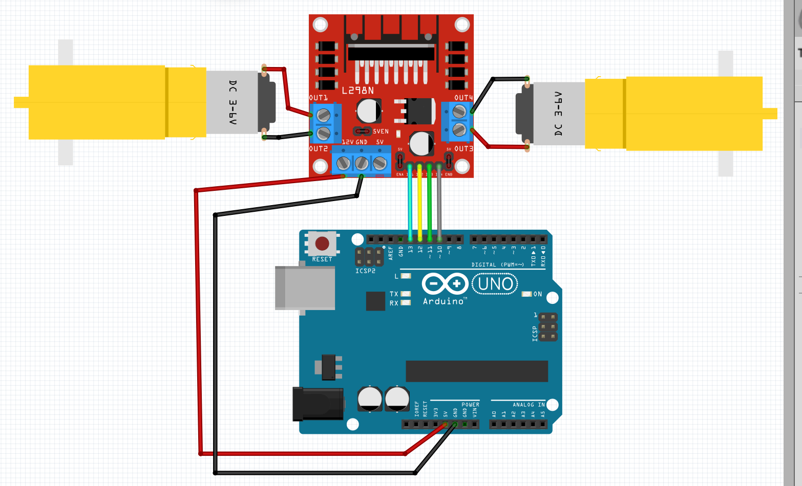

# DC -Motors

Ok, this is not a sensor, but it's a very useful ouptut. 

To connect a motor you need a driver, the most common is the **L298N**, with that one you can connect one or two mottors. 

With the connection showing here you can use motors with maximum of 5v. without any expternal power

For motors that need more voltage you also can use this driver but you need to add an external power source. 

